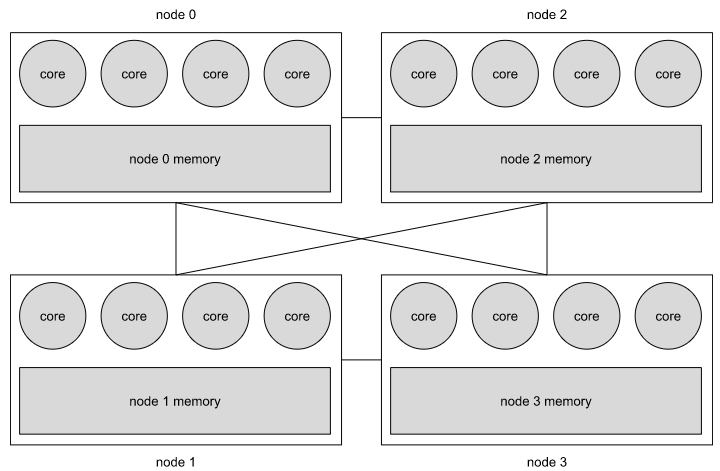

# Project Proposal

Scalable, NUMA-Aware Shared-Memory Data Structures
CS550 – Advanced Operating Systems
Jan 28, 2023

Jiaqi Ma A20501430
Bo Huang A20496327  
Qiming Lyu A20480567

## Introduction

NUMA (non-uniform memory access) is the phenomenon that memory at various points in the address space of a processor has different performance characteristics [1]. Compared with UMA (uniform memory access) architecture, in which all CPUs share the whole memory, NUMA architecture divides CPUs and memory into several “local parts” called nodes and supports each CPU to access the nearest memory location first. Certainly, it decreases the latency for small data. However, it also causes bad performance for shared-memory data structures since different CPUs will have significantly different latencies to the same memory region if they are from different nodes. In this project, we will implement a few NUMA-aware shared-memory data structures to solve the latency problem due to the NUMA architecture.

## Background Information

The signal path length from the processor to memory plays an important role when evaluating the speed performance. Take a system with NUMA for example (as Figure 1 shows), NUMA architecture brings memory nearer to processors [2]. Access from a single core to remote memory at other nodes has much higher latency compared to local memory within a node because of longer signal paths, interconnections between nodes and remote memory controllers. As the requirement for speed grows, NUMA systems become popular.

  

Figure 1, A System with 4 Nodes and 16 Processors

Shared memory under the NUMA architecture can access memory faster, improve system throughput, improve scalability, improve program performance, and improve System reliability. There are many occasions that need to use NUMA shared memory, such as

1. High-performance computing (HPC) environment: In this environment, the use of NUMA shared memory can improve program performance on multi-node systems.
2. Distributed database system: Using NUMA shared memory can speed up data sharing in a distributed database system.
3. Distributed storage system: Using NUMA shared memory can improve the performance of distributed storage system.

There are many library functions that use NUMA shared memory, including numactl, Boost, BCL, HCL, etc. NUMA machines provide higher performance when programs run on a single NUMA node. However, when it comes to shared memory, a program may span multiple NUMA nodes, causing performance differences.

## Problem Statement

Currently, the implementations of many shared-memory libraries like Boost, BCL, and HCL do not consider the NUMA effects seriously [3],[4]. Boost is a C++ library developed and maintained by the Boost community. It provides a large number of high-quality, portable, cross-platform C++ components that can help developers write C++ code more efficiently. Boost.Interprocess provides a set of classes and functions to manage shared memory, including support for NUMA shared memory [5],[6]. But Boost does not support some important and frequently-used shared memory data structures like unordered_map and unordered_set. Obviously, supporting NUMA has an impact on performance, but we don't know how much this impact is so far.

## Related Work

In this project, we will implement several shared-memory NUMA-aware data structures (in C++) and evaluate their performance by comparing them with non-NUMA-aware data structures from Boost. The development and test work may include jobs as following,

1. Establish a test environment supporting NUMA.
2. Design test cases to test share-memory performance.
3. Test the performance of the benchmark library, such as Boost.
4. Implement library functions that support NUMA bases on the benchmark lib.
5. Test the performance of optimized library functions using the same test cases.

## Proposed Solution

Our possible solution now is as follows:

1. Using one Ares node as the test performance which provides 2 NUMA nodes.
2. Use Boost as a benchmark for performance testing.
3. The data structures which may be opimized list as following [7],[8],
    a. singly linked list (with locking, and it will be used to implement unorder_map and unordered_set)
    b. parallel queue (with locking)
    c. unordered_map (array-based)
    d. unordered_set (array-based)
    e. unordered_map (list-based, using the implemented singly linked list)
    f. unordered_set (list-based, using the implemented singly linked list)
    g. lock-free queue (depending on time)
    h. lock-free singly linked list (depending on time)
4.The test cases should cover a workload which will benefit from the read nearness, a workload which will benefit from the write nearness, and then a more mixed workload which may not benefit from either.

We should consider the issues as following,

1. Memory management: Under NUMA architecture, memory management becomes more complicated because it needs to take into account the memory availability of each node.
2. Memory allocation: Under the NUMA architecture, it is necessary to consider how to allocate and release memory between different nodes to improve performance.
3. Performance optimization: Under NUMA architecture, you need to consider how to optimize memory access, such as using local memory or remote memory.
4. Data synchronization: Under the NUMA architecture, it is necessary to consider how to synchronize data between different nodes to avoid race conditions.
5. Programming model: Under the NUMA architecture, it is necessary to consider how to change the programming model to adapt to this new hardware architecture.
6. Testing and Debugging: NUMA libraries are more difficult to test and debug because they require a specific hardware environment.

## Evaluation

We are going to evaluate all data structures we implemented by comparing them with non-NUMA-aware data structures from Boost. The testbed will be Ares cluster with multiple NUMA nodes.

1. Using testing software to test the access latency of shared memory. The software may include, but not limit to, Intel Memory Latency Checker, perf, numactl, etc.
2. Write some test cases by ourselves in the same time, using Linux memory management functions to control memory allocation, and using Linux system tools like std::chrono to measure time.
3. Design some workload as test cases, the test includes the following aspects
     1. Test different data sizes to understand the impact of memory bandwidth and latency.
     2. Test different numbers of concurrent threads to understand the impact of the number of threads on performance.
     3. Test different access patterns (such as random access and sequential access) to understand the impact of access patterns on performance.
     4. Test the allocation of shared memory on different NUMA nodes to understand the impact of the allocation method on performance.
     5. Test the performance under different system environments and parameter settings to understand the impact of the system on performance.
     6. Compare the performance with other shared memory types such as shm, mmap, sysv, etc.

## Conclusions

We plan to quantify the impact of NUMA on shared memory data structures. The existing C++ library has very limited support for NUMA, there is no NUMA support for some basic and commonly used data structures. We will optimize some commonly use data structures to support NUMA. Then, by using different test software and test cases, we will observe the impact of supporting NUMA on the performance of using shared memory.

It is expectd to achieve through this project as following,
    1. Establish a NUMA performance testing environment and establish a performance baseline
    2. Implement some commonly use data structure of C++ library that supports NUMA in anticipation of improved memory access performance
    3. Make sure that the new implementation library can run in the real environment.

## Additional Resources

### Timeline

| Week | Task                                                                            |
|:----:|---------------------------------------------------------------------------------|
| 1    | Study for relevant concepts, papers, and courses                                |
| 2    | Setting up the evaluation environment                                           |
| 3    | Test and build the baseline of performance                                      |
| 4    | Present the intermediate report (midterm)                                       |
| 5    | Select optimization method and design structures, Implement the data structures |
| 6    | Coding, Evaluate implementations                                                |
| 7    | Code / Fix bugs for better evaluation results, evaluate continuously            |
| 8    | Write the final report and the final presentation                               |

### Deliverables

* One final report in PDF form.
* One final Powerpoint presentation.
* Source code

## References

[1] Christoph Lameter, “NUMA (Non-Uniform Memory Access): An Overview,” Acmqueue Aug 9, 2013.
[2] Qing Wang, Youyou Lu, Junru Li, and Jiwu Shu, Tsinghua University, “Nap: A Black-Box Approach to NUMA-Aware Persistent Memory Indexes,” USENIX Association 15th USENIX Symposium on Operating Systems Design and Implementation.
[3] Hariharan Devarajan, Anthony Kougkas, Keith Bateman, Xian-He Sun, "HCL: Distributing Parallel Data Structures in Extreme Scales," IEEE International Conference on Cluster Computing, 2020
[4] Benjamin Brock, Aydın Buluç, Katherine Yelick, "BCL: A Cross-Platform Distributed Data Structures Library," August 2019, Kyoto, Japan
[5] https://www.boost.org/doc/libs/1_77_0/doc/html/interprocess.html
[6] Christoph Lameter, "An overview of non-uniform memory access," acmqueue, Sep 2013.
[7] Steve Scargall, "Programing Persistent Memory, A Comprehensive Guide for Developers," Apress, 2020
[8] Kaiyuan Zhang, Rong Chen, Haibo Chen, "NUMA-Aware Graph-Structured Analytics," PPoPP'15, Feb 7-11, 2015, San Francisco, CA, USA
